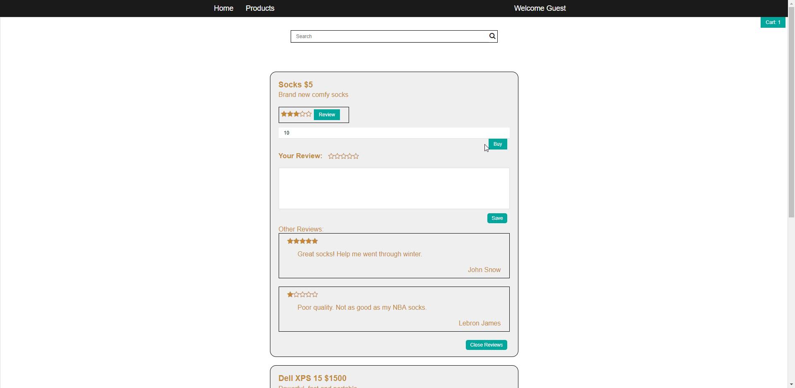
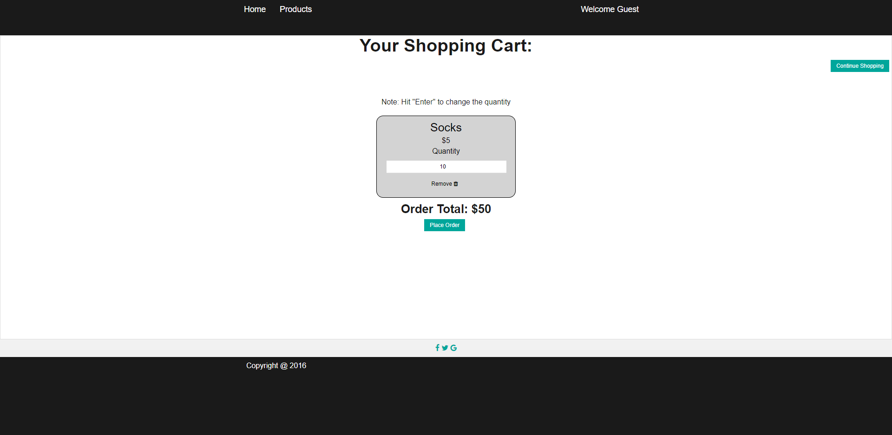

CMPS 183 Spring 2019

A full-stack online shopping website built with Web2py and Vue.js, which allows the user to:

    (1) create products
    (2) leave reviews and ratings
    (3) read others' reviews and ratings
    (4) buy products

Below are some screenshots of the website.

(1) Shopping Page

(2) Cart Page

